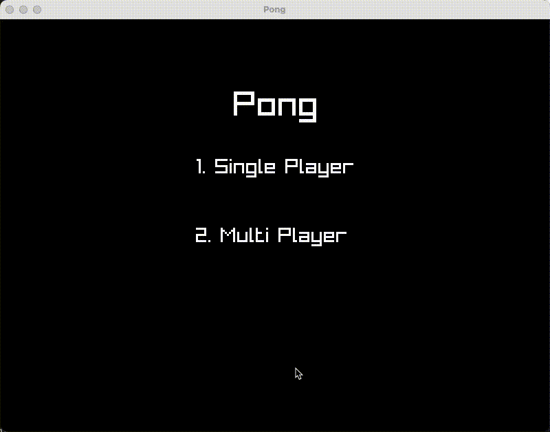

# Pong

A Pong implemented in C++ using the Raylib library. This project features a classic two-player mode (PvP) and a single-player mode with AI-controlled opponent.

## Table of Contents
- [Features](#features)
- [Installation](#installation)
- [Usage](#usage)
- [Controls](#controls)
- [Screenshots](#screenshots)
- [License](#license)
- [Acknowledgements](#acknowledgements)

## Features
- Two-player mode (PvP)
- Single-player mode with AI opponent

## Installation

### Prerequisites
- C++ compiler (e.g., g++, clang++)
- [Raylib](https://www.raylib.com/) library

### Build Instructions
1. Clone the repository:
    ```bash
    git clone https://github.com/yourusername/pong-game.git
    cd pong-game
    ```

2. Compile the project:
    ```bash
    make clean
    make
    ```

3. Run the executable:
    ```bash
    ./bin/main
    ```

## Controls
- **Player 1 (Left Paddle)**
  - `W` key: Move up
  - `S` key: Move down

- **Player 2 (Right Paddle) / AI Paddle**
  - `UP` arrow key: Move up
  - `DOWN` arrow key: Move down

## Screenshots



## License
This project is licensed under the MIT License. See the [LICENSE](LICENSE) file for details.

## Acknowledgements
- [Raylib](https://www.raylib.com/) for the graphics library

